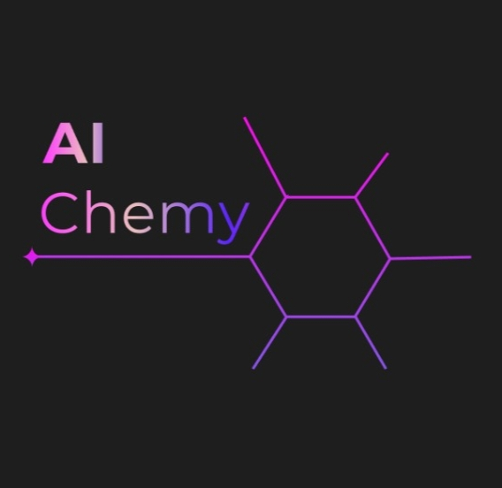
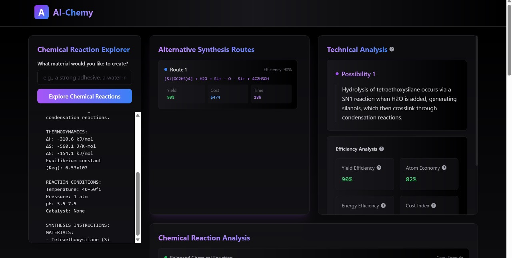
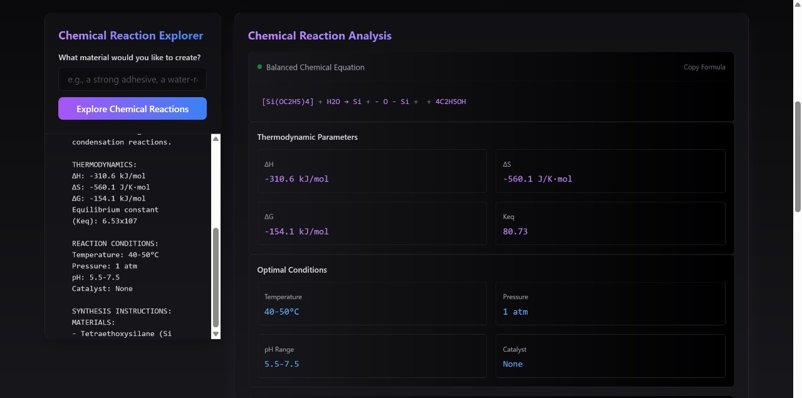
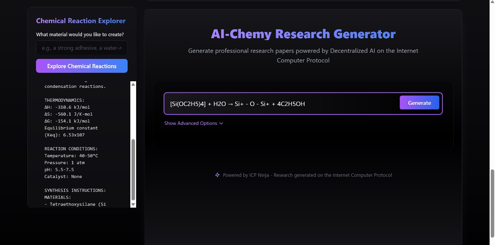
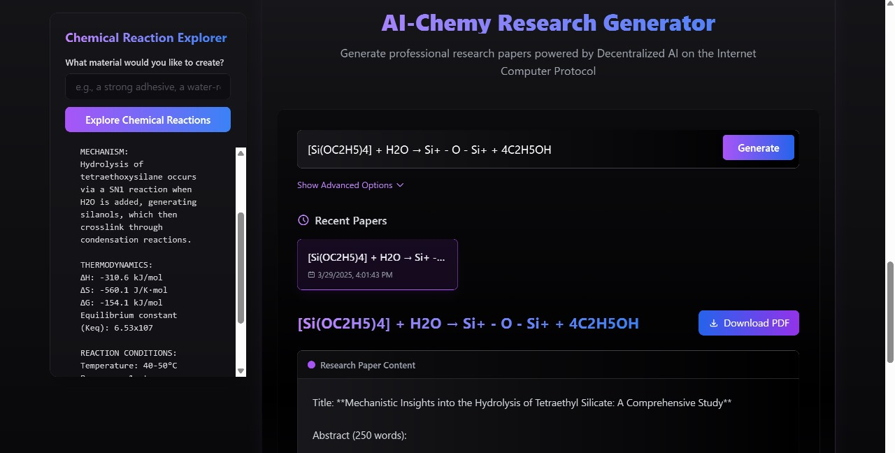
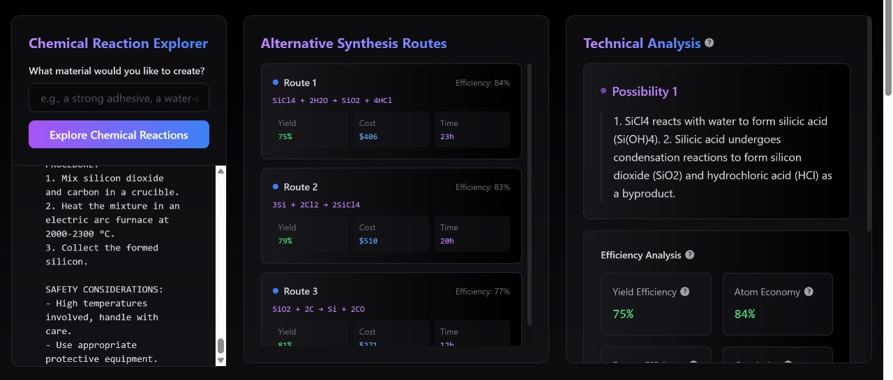
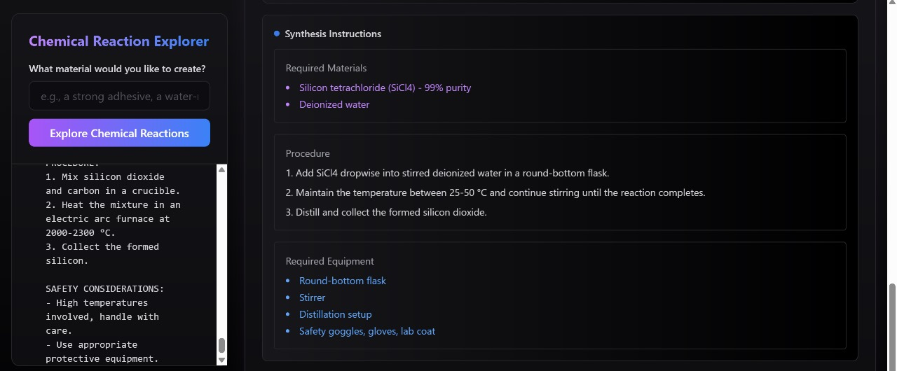
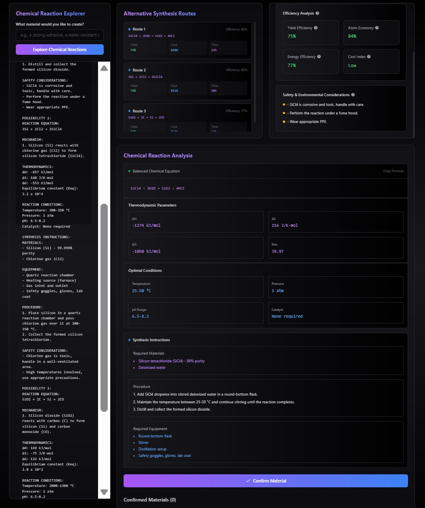

# AI-chemy Documentation

<div align="center">
  
  <h3>AI-Powered Material Synthesis & Research Platform</h3>
  <p>Built on Internet Computer Protocol (ICP) using ICP Ninja IDE</p>
</div>

## Table of Contents
- [Overview](#overview)
- [Technical Stack](#technical-stack)
- [Project Structure](#project-structure)
- [Development Guide](#development-guide)
- [Core Features](#core-features)
- [Deployment](#deployment)
- [Troubleshooting](#troubleshooting)
- [AI Model Performance](#ai-model-performance)

## Overview

AI-chemy is a cutting-edge platform that combines artificial intelligence with chemical synthesis research. Built on the Internet Computer Protocol, it leverages LLaMA-based models to provide:

- 🧪 AI-driven material synthesis analysis
- 🔍 Real-time chemical reaction visualization
- 📊 Comprehensive research data analysis

## Technical Stack

- **Frontend**: React 18.3.1 with Vite 5.4.11
- **Backend**: Rust on ICP
- **AI Models**: LLaMA 3.1 8B
- **Styling**: Tailwind CSS 3.4.14
- **Development Environment**: ICP Ninja IDE

## Project Structure

```text
/
├── backend/                           # Rust canister code
│   ├── Cargo.toml                    # Rust dependencies
│   └── lib.rs                        # LLaMA model integration
│
├── frontend/                         # React frontend application
│   ├── public/                      # Static assets
│   │   └── Logo.jpg                # Application logo
│   │
│   ├── src/                        # Source code
│   │   ├── components/             # Reusable UI components
│   │   │   ├── ResearchDisplay.jsx # Research results display
│   │   │   └── Tooltip.jsx        # Tooltip component
│   │   │
│   │   ├── contexts/              # React contexts
│   │   │   └── ChemyContext.jsx   # Chemistry processing logic
│   │   │
│   │   ├── pages/                 # Application pages
│   │   │   ├── alternativetab.jsx
│   │   │   ├── composertab.jsx
│   │   │   ├── generaltab.jsx
│   │   │   ├── home.jsx
│   │   │   └── researchlab.jsx
│   │   │
│   │   ├── layout/                # Layout components
│   │   │   ├── navbar.jsx
│   │   │   ├── footer.jsx
│   │   │   └── chatbox.jsx
│   │   │
│   │   └── main.jsx              # Application entry point
│   │
│   ├── index.html                # HTML entry point
│   ├── index.css                 # Global styles
│   ├── tailwind.config.js        # Tailwind CSS configuration
│   ├── postcss.config.js         # PostCSS configuration
│   ├── vite.config.js           # Vite configuration
│   └── package.json             # Frontend dependencies
│
├── config/                      # Configuration files
│   ├── dfx.json                # ICP canister configuration
│   └── rust-toolchain.toml     # Rust toolchain specification
│
├── Cargo.toml                  # Rust workspace configuration
├── Cargo.lock                  # Rust dependency lock
├── package.json                # Root package configuration
├── package-lock.json           # Dependency lock file
├── .gitignore                  # Git ignore rules
├── BUILD.md                    # Build instructions
└── README.md                   # Project documentation
```

### Key Directories

- `backend/`: Contains the Rust canister code that integrates with LLaMA model
- `frontend/`: React application with components, pages, and layouts
- `config/`: Project configuration files for ICP and Rust
- `frontend/src/components/`: Reusable UI components
- `frontend/src/contexts/`: React contexts for state management
- `frontend/src/pages/`: Main application pages
- `frontend/src/layout/`: Layout components like navbar and footer

## Development Guide

### Prerequisites
- ICP Ninja IDE
- Web Browser (Chrome/Firefox recommended)
- Internet Computer Identity (for deployment)

### Development Options

#### Option 1: ICP Ninja IDE (Recommended for Quick Start)
1. Open ICP Ninja IDE in your browser
2. Create a new project or open existing
3. The IDE provides a temporary development environment valid for 20 minutes
4. Use the built-in deployment feature for testing

#### Option 2: Local Development
1. Install developer tools:
   - Dev Containers (Windows)
   - Native Installation (macOS/Linux)
2. Set up Internet Computer identity
3. Deploy locally

## Core Features

### Chemistry Processing
The chemistry processing context manages AI-driven material synthesis analysis using LLaMA model on ICP:

```javascript
const { chemyLogic, isLoading } = useChemy();
```

### Styling System
Tailwind CSS configuration:

```javascript
// tailwind.config.js
export default {
  content: ['./src/**/*.{js,ts,jsx,tsx}']
};
```

## Deployment

### ICP Ninja IDE Deployment
1. Build & Deploy process
2. Mainnet deployment steps

### Environment Configuration
```env
VITE_CANISTER_ID=<canister-id>
VITE_HOST=https://ic0.app  # For production
```

## Troubleshooting

### Common Issues
1. **Canister Deployment Failed**
   - Check cycles balance
   - Verify canister settings
   - Ensure proper identity configuration

2. **Development Container Issues**
   - Ensure Docker is running
   - Check port availability (4943, 5173)
   - Verify VS Code extensions

## AI Model Testing

### AI Model llama 





### AI Model GPT 3.5-turbo



